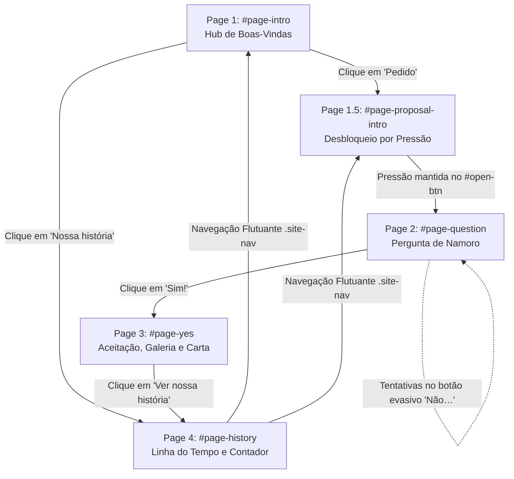
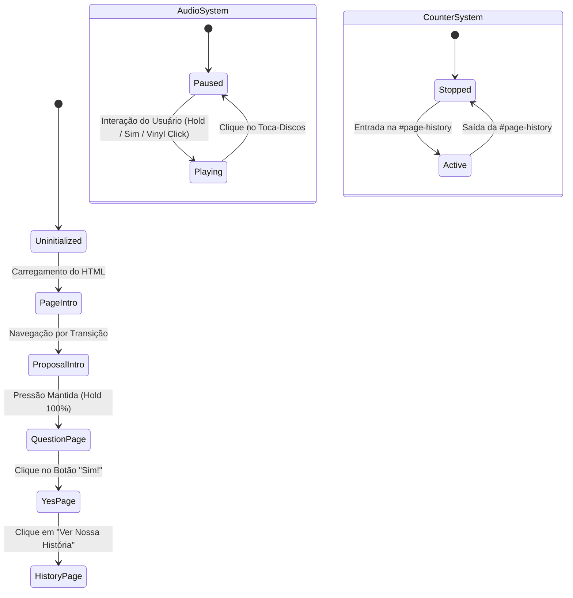

# Contexto do Projeto: Open — Aplicação Web Romântica Interativa

> **Documentação de Arquitetura, Funcionalidades, User Journey e Inventário de Assets**  
> *Projeto desenvolvido para Murilo Fuzi Correia e Ana Paula Germano de Oliveira*

---

## 1. Visão Geral e Propósito do Projeto

O **Open** é uma Single-Page Application (SPA) web romântica e altamente interativa, concebida como um pedido formal de namoro e um diário digital comemorativo da história do casal **Murilo Fuzi Correia** e **Ana Paula Germano de Oliveira**.

A aplicação combina narrativa visual imersiva, física de elementos interativos, animações em tempo real e sensibilidade estética elevada para proporcionar uma jornada inesquecível de navegação.

### Principais Pilares Estruturais e Tecnológicos
* **Arquitetura Zero-Build / Vanilla Stack**: Construída inteiramente em HTML5 semântico, CSS3 moderno (com variáveis de ambiente CSS, layouts Flexbox/Grid, animações de transform/opacity aceleradas por GPU) e JavaScript ES6+ puro (vanilla).
* **Renderização Gráfica Avançada**: Fundo dinâmico procedural animado via **WebGL Shaders** (efeito nebulosa galáctica com ruído FBM e campo de estrelas) combinado com um canvas 2D secundário para emissão de emojis flutuantes.
* **UX Hápica e Microinterações**: Suporte a padrões de vibração de dispositivos móveis (`navigator.vibrate`), física evasiva de botão com quebra em partículas (efeito shatter), rastreio de cursor iluminado, efeito de ondulação ao toque (*click ripples*) e efeito de máquina de escrever (*typewriter effect*) com velocidade variável para pontuações.
* **Precisão Temporal e Fuso Horário**: Contador de relacionamento recalculado a cada segundo com precisão absoluta usando `Intl.DateTimeFormat` ancorado no fuso horário de Brasília (`America/Sao_Paulo`).

---

## 2. Arquitetura Geral de Arquivos

O repositório apresenta uma estrutura limpa, minimalista e autoconteúdo, centralizando a aplicação inteira em um único ponto de entrada para garantir portabilidade instantânea e ausência de dependências de compilação ou bundlers externos.

```
c:\Users\User\Documents\GitHub\open\
├── index.html               # Aplicação principal (HTML5, CSS, WebGL Shader & JS incorporados)
├── README.md                # Documentação sintética da árvore de arquivos do repositório
├── LSmusica.mp3             # Trilha sonora oficial em formato áudio MP3 (6.05 MB)
└── imagensParaADD/          # Diretório de assets fotográficos do casal (24 imagens JPEG)
    ├── foto_1.jpeg
    ├── foto_2.jpeg
    ├── foto_3.jpeg
    ├── foto_4.jpeg
    ├── foto_5.jpeg
    ├── foto_6.jpeg
    ├── foto_7.jpeg
    ├── foto_8.jpeg
    ├── foto_9.jpeg
    ├── foto_10.jpeg
    ├── foto_11.jpeg
    ├── foto_12.jpeg
    ├── WhatsApp Image 2026-08-08 at 18.12.41.jpeg
    ├── WhatsApp Image 2026-08-08 at 18.12.41 (1).jpeg
    ├── WhatsApp Image 2026-08-08 at 18.12.41 (2).jpeg
    ├── WhatsApp Image 2026-08-08 at 18.12.41 (3).jpeg
    ├── WhatsApp Image 2026-08-08 at 18.12.41 (4).jpeg
    ├── WhatsApp Image 2026-08-08 at 18.12.41 (5).jpeg
    ├── WhatsApp Image 2026-08-08 at 18.12.41 (6).jpeg
    ├── WhatsApp Image 2026-08-08 at 18.12.41 (7).jpeg
    ├── WhatsApp Image 2026-08-08 at 18.12.41 (8).jpeg
    ├── WhatsApp Image 2026-08-08 at 18.12.41 (9).jpeg
    ├── WhatsApp Image 2026-08-08 at 18.12.41 (10).jpeg
    └── WhatsApp Image 2026-08-08 at 18.12.41 (11).jpeg
```

### Detalhamento dos Componentes do Repositório
* **`index.html`** (~98 KB / 3091 linhas): Contém o markup estrutural de todas as páginas/telas, estilizações CSS completas (incluindo responsividade para smartphones e desktops), shaders em GLSL (OpenGL Shading Language) para WebGL, rotinas de eventos touch/mouse e controle dos modais.
* **`README.md`**: Diagrama simplificado apresentando a arquitetura do projeto.
* **`LSmusica.mp3`**: Trilha de fundo com execução contínua (`loop`), ativada mediante interação voluntária da usuária.
* **`imagensParaADD/`**: Conjunto de fotos otimizadas para exibição na galeria cinematográfica da aceitação do pedido e na linha do tempo cronológica.

---

## 3. Mapeamento de Páginas e Telas (User Journey)

A navegação ocorre através da alteração dinâmica de visibilidade da classe `.page.active` gerida pela função JavaScript `transitionTo(pageId)`, acompanhada por um overlay de transição `#trans-overlay` que suaviza as passagens de tela.



---

### Page 1 (`#page-intro`) — Hub de Boas-Vindas
* **Propósito**: Recepção inicial com apresentação estética solene dos nomes do casal e direcionamento claro.
* **Elementos de Interface**:
  * Cabeçalho prévio (`.intro-pre`): *"Murilo Fuzi Correia e Ana Paula Germano de Oliveira"*.
  * Título tipográfico (`.hub-couple`): Exibição estilizada com caractere "&" em itálico com gradiente rosa (`.hub-amp`).
  * Subtítulo explicativo (`.hub-copy`): *"Um lugar para guardar o pedido, as lembranças e o tempo bonito que começou entre nós."*
  * Botões de Ação (`.hub-actions`):
    * `Primary`: Direciona para a entrada do pedido (`page-proposal-intro`).
    * `Secondary`: Direciona para a linha do tempo (`page-history`).
  * Nota de rodapé (`.hub-footnote`): *"escolha por onde quer começar"*.

---

### Page 1.5 (`#page-proposal-intro`) — Tela de Desbloqueio e Preparação
* **Propósito**: Criar suspense e antecipação através de uma ação tátil deliberada antes de revelar a pergunta principal.
* **Elementos de Interface e Mecânica**:
  * Mensagem dedicada a Ana Paula Germano de Oliveira com efeitos de glitch tipográfico (`.intro-title-wrap::before` e `::after`).
  * Botão de desbloqueio radial (`#open-btn`):
    * Exige que o usuário **pressione e segure** o botão para acumular progresso.
    * Utiliza `requestAnimationFrame` para expandir suavemente o gradiente radial (`.btn-glow`) de `scale(1)` até `scale(3.5)`.
    * Dispara pulsações de vibração hápica (`navigator.vibrate(30)`) a cada 15% de progresso acumulado, culminando em um padrão final `[50, 50, 100]` ao atingir 100%.
    * Aciona automaticamente o carregamento e início do áudio de fundo (`startMusic()`).

---

### Page 2 (`#page-question`) — A Pergunta de Namoro
* **Propósito**: Ponto central da aplicação ("Você aceita namorar comigo?"), munido de elementos lúdicos e interativos.
* **Elementos de Interface e Mecânica**:
  * Chip indicador superior (`.q-chip`): *"✦ uma pergunta ✦"*.
  * Título com destaque itálico degradê dourado/rosa (`.q-headline em`): *"Você aceita namorar comigo?"*.
  * **Botão "Sim!" (`.btn-sim`)**: Botão magnético com gradiente animado, efeito shimmer reflexivo e acionamento da função `goToYes()`.
  * **Botão Evasivo "Não…" (`#btn-no`)**:
    * Posição inicial acoplada a um container reservado (`#btn-no-placeholder`), transformando-se em elemento `fixed` flutuante via JS.
    * Ao detectar reaproximação do cursor (`mouseover`) ou toque em telas sensíveis (`touchstart`), a função `runAway()` sorteia novas coordenadas `(X, Y)` dentro da viewport garantindo distância mínima de 80px da posição anterior.
    * **Mecânica de Fragmentação/Shatter (7 Tentativas)**: Após a 7ª tentativa frustrada de clique (`MAX = 7`), o botão "Não…" sofre uma explosão visual: 30 partículas coloridas são geradas no centro do botão e arremessadas com aceleração vetorial e gravidade fictícia. Em seguida, o botão é destruído e substituído pela mensagem bem-humorada: *"Você achou mesmo que ia ter escolha? 😈💜"*.

---

### Page 3 (`#page-yes`) — Tela de Aceitação e Celebração
* **Propósito**: Celebração do "Sim", exibição da galeria de primeiros momentos, abertura da carta secreta e acesso à trilha de áudio.
* **Elementos de Interface e Mecânica**:
  * **Efeito Confeti (`launchConfetti()`)**: Renderização de 160 partículas multicolores (círculos, retângulos e fitas) caindo com rotação e oscilação senoidal sobre o canvas `#cfc`.
  * **Monograma (`.yes-monogram`)**: Emblema circular com iniciais `M × A` sob iluminação neon.
  * **Galeria Cinematográfica (`.gallery`)**: Grid responsivo exibindo os primeiros registros (`foto_1.jpeg` a `foto_4.jpeg`) com zoom progressivo ao passar o cursor e acionamento do lightbox 3D ao clicar.
  * **Assinatura Emocional**: *"Com amor, Murilo Fuzi Correia"*.
  * **Lançador da Carta Secreta (`#open-letter`)**: Botão pulsante decorado com selo de carta estilizado (`.letter-seal`).
  * **Dock do Toca-Discos de Vinil**: O controle de música flutuante é realocado para o fluxo interno da página através de `syncMusicTogglePlacement('page-yes')`.

---

### Page 4 (`#page-history`) — Linha do Tempo e Contador em Tempo Real
* **Propósito**: Registro vivo da história do casal, acompanhado por um cronômetro de alta precisão.
* **Elementos de Interface e Mecânica**:
  * **Contador de Relacionamento (`.love-counter`)**:
    * Calcula o tempo decorrido desde **12 de Maio de 2026 às 20:25** (fuso horário `America/Sao_Paulo`).
    * Painel dividido em 6 caixas numéricas: **Anos, Meses, Dias, Horas, Minutos e Segundos**.
    * Atualização via `setInterval` a cada 1000ms.
  * **Galeria Cronológica por Datas (`.history-gallery`)**: Grid responsivo com 12 cards fotográficos contendo memórias do casal (`WhatsApp Image 2026-08-08...`).
  * Ordenação automática dos cards via JavaScript (`sortHistoryGallery()`) com base no atributo `data-date`.

---

## 4. Estrutura de Componentes e Interface

```
┌─────────────────────────────────────────────────────────────────────────────┐
│                            BARRA DE NAVEGAÇÃO                               │
│                         [.site-nav] (Fixed Top)                             │
└─────────────────────────────────────────────────────────────────────────────┘
                                     │
┌────────────────────────────────────┴────────────────────────────────────────┐
│                        ÁREA PRINCIPAL DE CONTEÚDO                           │
│     [#page-intro]  |  [#page-proposal-intro]  |  [#page-question]           │
│     [#page-yes]    |  [#page-history]                                       │
└────────────────────────────────────┬────────────────────────────────────────┘
                                     │
┌────────────────────────────────────┼────────────────────────────────────────┐
│             MODAIS E COMPONENTES AUXILIARES OVERLAY                         │
│  ├─ [#letter-modal]      -> Carta Secreta com Máquina de Escrever           │
│  ├─ [#photo-lightbox]    -> Lightbox 3D Cinematográfico com SVG e Partículas│
│  ├─ [.music-toggle]      -> Toca-Discos de Vinil (Dock Flutuante / Inline)  │
│  └─ [#gl-canvas]         -> Shader WebGL de Fundo (Galáxia / Nebulosa)      │
└─────────────────────────────────────────────────────────────────────────────┘
```

### 1. Barra de Navegação Flutuante (`.site-nav`)
* **Posicionamento**: `fixed` centralizado no topo com `backdrop-filter: blur(16px)` e bordas arredondadas pill-shape.
* **Comportamento de Visibilidade**: Permanece oculta na tela inicial (`#page-intro`) e exibe-se automaticamente nas páginas secundárias (`pagesWithNav = ['page-proposal-intro', 'page-yes', 'page-history']`).

---

### 2. Dock Toca-Discos de Vinil (`.music-toggle`)
* **Visual**: Reproduz a estética de um disco de vinil em miniatura com sulcos concêntricos, etiqueta central magenta/violeta e braço do toca-discos (`.music-arm`).
* **Estados e Animações**:
  * `Tocando (.on)`: Rotação contínua do disco (`animation: spinDisc 3.2s linear infinite`) e inclinação do braço metálico sobre o disco (`transform: rotate(16deg)`).
  * `Pausado`: Disco estático e braço recolhido (`transform: rotate(32deg)`).
* **Posicionamento Dinâmico**: Permanece fixo no canto inferior direito (`bottom: 18px; right: 18px`), mas é movido para dentro do fluxo da tela `#page-yes` quando ela se torna ativa.

---

### 3. Modal de Carta Secreta (`#letter-modal`)
* **Construção**: Injetado dinamicamente no DOM a partir da tag `<template id="letter-modal-template">`.
* **Animação de Abertura**: Simula o desdobramento da aba superior do envelope (`.letter-envelope::before` com `rotateX(180deg)`), seguido da elevação da folha de papel (`.letter-paper`).
* **Efeito Máquina de Escrever (Typewriter)**:
  * Renderiza o texto caractere por caractere com cursor rosa piscante (`.letter-caret`).
  * Ritmo de digitação adaptativo: 26ms para caracteres normais, 110ms para pontos finais e 220ms para quebras de linha (`\n`).
  * **Botão "Skip" (`#letter-skip`)**: Permite interromper a animação e exibir o texto completo instantaneamente.

---

### 4. Modal Lightbox 3D de Fotos (`#photo-lightbox`)
* **Visual e Transição**:
  * Abertura com efeito 3D em perspectiva (`perspective(1200px) rotateX(...) scale3d(...)`).
  * Fundo com desfoque de profundidade (`backdrop-filter: blur(22px)`).
  * Moldura degradê animada (`.photo-lightbox-frame`) com efeito shimmer CSS.
  * 8 partículas luminosas orbitais (`.plx-particle`) expandindo em anel.
  * Cantoneiras ornamentais SVG desenhadas dinamicamente via animação da propriedade `stroke-dashoffset`.

---

## 5. Gerenciamento de Estado e Ciclo de Vida



### Resumo dos Principais Ciclos de Vida e Controladores JS

1. **Ciclo de Animação WebGL (`loop`)**:
   * O shader calcula em cada frame as posições das coordenadas de tela, tempo transcorrido (`u_time`) e posição do cursor do mouse/touch (`u_mouse`).
   * **Pausa de Desempenho**: Monitora o evento `visibilitychange`. Quando a aba do navegador fica oculta (`document.hidden === true`), a renderização por `requestAnimationFrame` é pausada para preservar recursos da GPU e bateria.

2. **Gerenciador do Contador em Tempo Real (`updateRelationshipCounter`)**:
   * Define a data-base de início do namoro: **`2026-05-12T20:25:00-03:00`**.
   * Emprega a API nativa `Intl.DateTimeFormat` configurada para `America/Sao_Paulo`.
   * A função `getElapsedParts()` calcula precisamente anos bissextos, variação de dias por mês e horas/minutos/segundos decorridos sem desvio de fuso horário.
   * Mantém um timer via `setInterval(tick, 1000)` ativo apenas enquanto a `#page-history` estiver visível.

3. **Gerenciador do Botão de Pressão Mantida (`startHold` / `stopHold`)**:
   * Vincula ouvintes para eventos de ponteiro (`pointerdown`, `pointerup`, `pointercancel`, `touchstart`, `touchend`).
   * Incrementa o progresso a cada ciclo de `requestAnimationFrame`, aplicando escala proporcional ao elemento de iluminação (`.btn-glow`).

---

## 6. Inventário de Assets e Recursos

### Tipografia Externa (Google Fonts)
* **`Cormorant Garamond`** (Pesos: 300, 400, 600, Italic): Utilizada para títulos principais, monogramas, headlines românticas e corpo da carta secreta.
* **`Montserrat`** (Pesos: 200, 300, 400, 500, 600): Utilizada para textos de apoio, botões de ação, chips de navegação e componentes de interface.

### Áudio Local
* **`LSmusica.mp3`**:
  * Tamanho: 6.05 MB (6.053.445 bytes).
  * Formato: MPEG Audio Layer 3 (MP3).
  * Configuração HTML: `<audio id="bg-music" loop preload="metadata" playsinline>`.

### Galeria de Imagens Local (`imagensParaADD/`)
O diretório possui **24 arquivos JPEG**, mapeados conforme a tabela abaixo:

| Nome do Arquivo | Tamanho | Utilização Principal na Aplicação |
| :--- | :--- | :--- |
| `foto_1.jpeg` | 53.9 KB | Card Destaque Full-Width na Galeria da Aceitação (`#page-yes`) |
| `foto_2.jpeg` | 93.1 KB | Card Metade na Galeria da Aceitação (`#page-yes`) |
| `foto_3.jpeg` | 49.1 KB | Card Metade na Galeria da Aceitação (`#page-yes`) |
| `foto_4.jpeg` | 149.4 KB | Card Destaque Full-Width na Galeria da Aceitação (`#page-yes`) |
| `foto_5.jpeg` | 86.8 KB | Acervo Sobressalente / Expansão |
| `foto_6.jpeg` | 81.3 KB | Acervo Sobressalente / Expansão |
| `foto_7.jpeg` | 99.9 KB | Acervo Sobressalente / Expansão |
| `foto_8.jpeg` | 51.8 KB | Acervo Sobressalente / Expansão |
| `foto_9.jpeg` | 64.9 KB | Acervo Sobressalente / Expansão |
| `foto_10.jpeg` | 155.2 KB | Acervo Sobressalente / Expansão |
| `foto_11.jpeg` | 145.4 KB | Acervo Sobressalente / Expansão |
| `foto_12.jpeg` | 118.2 KB | Acervo Sobressalente / Expansão |
| `WhatsApp Image 2026-08-08 at 18.12.41.jpeg` | 53.9 KB | Card 1 da Galeria da Linha do Tempo (`#page-history`) |
| `WhatsApp Image 2026-08-08 at 18.12.41 (1).jpeg` | 93.1 KB | Card 2 da Galeria da Linha do Tempo (`#page-history`) |
| `WhatsApp Image 2026-08-08 at 18.12.41 (2).jpeg` | 49.1 KB | Card 3 da Galeria da Linha do Tempo (`#page-history`) |
| `WhatsApp Image 2026-08-08 at 18.12.41 (3).jpeg` | 149.4 KB | Card 4 da Galeria da Linha do Tempo (`#page-history`) |
| `WhatsApp Image 2026-08-08 at 18.12.41 (4).jpeg` | 86.8 KB | Card 5 da Galeria da Linha do Tempo (`#page-history`) |
| `WhatsApp Image 2026-08-08 at 18.12.41 (5).jpeg` | 81.3 KB | Card 6 da Galeria da Linha do Tempo (`#page-history`) |
| `WhatsApp Image 2026-08-08 at 18.12.41 (6).jpeg` | 99.9 KB | Card 7 da Galeria da Linha do Tempo (`#page-history`) |
| `WhatsApp Image 2026-08-08 at 18.12.41 (7).jpeg` | 51.8 KB | Card 8 da Galeria da Linha do Tempo (`#page-history`) |
| `WhatsApp Image 2026-08-08 at 18.12.41 (8).jpeg` | 64.9 KB | Card 9 da Galeria da Linha do Tempo (`#page-history`) |
| `WhatsApp Image 2026-08-08 at 18.12.41 (9).jpeg` | 155.2 KB | Card 10 da Galeria da Linha do Tempo (`#page-history`) |
| `WhatsApp Image 2026-08-08 at 18.12.41 (10).jpeg` | 145.4 KB | Card 11 da Galeria da Linha do Tempo (`#page-history`) |
| `WhatsApp Image 2026-08-08 at 18.12.41 (11).jpeg` | 118.2 KB | Card 12 da Galeria da Linha do Tempo (`#page-history`) |

---

## 7. Paleta de Cores e Estilização

A linguagem de design visual baseia-se em um tema dark futurista e romântico, empregando tons de roxo profundo, rosa neon e detalhes em ouro reluzente através de variáveis CSS nativas:

```css
:root {
  --bg: #04000e;      /* Fundo ultra-escuro de contraste */
  --p1: #0d0020;      /* Roxo noturno profundo */
  --p2: #1a0038;      /* Roxo intermediário de profundidade */
  --p3: #6b21c8;      /* Violeta vibrante */
  --p4: #a855f7;      /* Roxo neon principal */
  --p5: #d8b4fe;      /* Lilás suave para tipografia secundária */
  --pink: #f472b6;    /* Rosa pastel brilhante */
  --pink2: #ec4899;   /* Magenta vibrante */
  --gold: #f5c842;    /* Dourado reluzente para destaques */
  --w: #ffffff;       /* Branco puro */
}
```

---

## 8. Conclusão

O projeto **Open** representa um exemplo impecável de engenharia frontend orientada à experiência emocional do usuário. Ele une performance com código monolítico sem dependências de compilação, gráficos avançados via WebGL, controle fino de tempo e fuso horário, e interatividade tátil envolvente.

---
*Documentação gerada pelo ContextAgent.*
